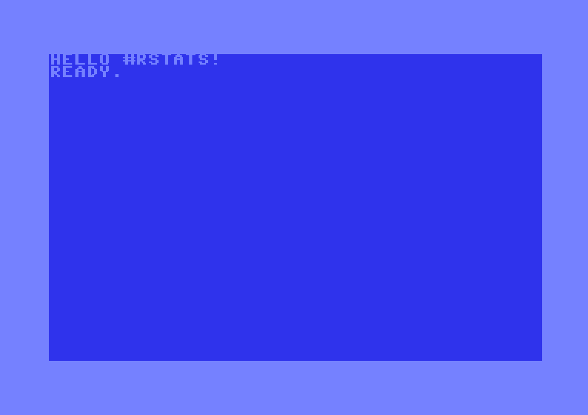

```{r setup, include = FALSE}
suppressPackageStartupMessages({
  library(dplyr)
  library(c64asm)  
})

knitr::opts_chunk$set(echo=TRUE)

if (FALSE) {
  pkgdown::build_site(override = list(destination = "../coolbutuseless.github.io/package/c64asm"))
}
```


# c64asm 

<!-- badges: start -->


<!-- badges: end -->

`{c64asm}` is a c64 6502 assembler written in R.

The syntax for the assembly code closely follows that of 
[TASS](https://sourceforge.net/projects/tass64/).

`{c64asm}` includes syntax extensions which allow for easier integration
of pre-computed values and data segments directly from R.


### c64 / 6502 

The Commodore 64 (c64) is an 8-bit home computer running on a Motorola 6510 
(a variant of the 6502).

The c64 supports 16 colours, 8 hardware sprites and a maximum resolution of 320x200 pixels.

It includes co-processors for sound (SID chip) and video (VIC-II) chip.

6502 machine code:

* 3 general purpose registers: A, X, Y
* No multiplication instruction


`{c64asm}` Features
------------------------------------------------------------------------------

General features

* Syntax similar to TASS64 syntax.
* Settable program counter
    * e.g. `* = $0801`
* Defined variables
    * e.g. `border = $d020`
* Low/High byte extraction from symbol (similar to TASS)
    * e.g. `lda #<routine` will store the low byte of the address of symbol `routine` in the `A` register

For integration with R

* `.rtext` directive to include an `R` string as text data
* `.rbyte` directive to include an `R` integer vector as bytes 
* `{...}` to delimit code to be evaluated at run time to manipulate labels and variables e.g. `lda {border + 1}`


Limitations
------------------------------------------------------------------------------


* R Errors will be thrown for most syntax errors in the assembly code.
* There are still corner cases which will compile into invalid machine code:
    * E.g. if the user orchestrates a `jmp` to a location more than 128 bytes away
     from the current program counter.
* `indirect indexed` and `indexed indirect` modes using symbolic addresses seems
  to work, but need more tests.
* You may need to force zero page addressing modes with symbols/variables by explicitly noting that only the low byte should
  be used. e.g.
    * `BUFPNT = $A6`  is the pointer to the tape i/o buffer
    * `lda <BUFPNT` should be used to force zero page addressing mode, otherwise `lda BUFPNT` would assume absolute addressing mode.
    * The actual result would be the same, but zero page addressing takes fewer bytes and takes fewer CPU cycles to execute than absolute.


Installation
------------------------------------------------------------------------------


```{r eval=FALSE}
devtools::install_github('coolbutuseless/c64asm')
```


Documentation
------------------------------------------------------------------------------

The documentation for the package is available online at [coolbutuseless.github.io](https://coolbutuseless.github.io/package/c64asm) 
(thanks to [pkgdown](https://github.com/r-lib/pkgdown))


Vignettes
------------------------------------------------------------------------------

* `helloworld` - write text to the screen
* `helloborder` - colour cycling in the border as fast as possible
* `helloworld_details` - a look at the intermediate assembly outputs during compilation
* `ascii` - Using R-specific `.rbyte` directive to put characters from an R variable into the assembly code
* `custom_character_set` - Building a custom character set in R and passing it into the assemblly code with the `.rbyte` directive.
* `symbol-arithmetic` - How to do arithmetic on the program counter and address labels

The code for the vignettes is also available in the `prg/` directory of this repository.

    

A simple 6502 program 
------------------------------------------------------------------------------

The following c64/6502 ASM code will clear the screen and then 
write `Hello #rstats!` at the top

```{r}
asm <- '
*=$0801
  .byte $0c, $08, $0a, $00, $9e, $20  ; 10 SYS 2080
  .byte $32, $30, $38, $30, $00, $00
  .byte $00

*=$0820
      lda #$93        ; Clear the screen
      jsr $ffd2

      ldx #$0        ; initialise the offset pointer into our message
loop  lda message,x   ; load a character and write it to screen 
      and #$3f        ; Manually place chars on screen
      sta $0400,x
      inx
      cpx #$0e
      bne loop

      rts

message
    .text "Hello #rstats!"
'
```


Compile the program and show the compiled program bytes
------------------------------------------------------------------------------

```{r}
prg <- c64asm::compile(asm)
prg
```


Run c64 programs using VICE
------------------------------------------------------------------------------

```{r eval=FALSE}
library(c64vice)

c64vice::run_prg(prg)
```

```{r echo=FALSE, eval=FALSE}
c64vice::save_screenshot("man/figures/hello-rstats.png")
```




Breakdown of assembly process
------------------------------------------------------------------------------

The compiler makes a few passes through the data to resolve symbol values.

The `c64asm::compile()` function is just a wrapper which calls the following 4 functions

1. `line_tokens <- c64asm::create_line_tokens(asm)`
    * For each line in the input break it into tokens.
    * Filter any rows that contain no instructions
2. `prg_df <- c64asm::create_prg_df(line_tokens)`
    * Create a data.frame from `line_tokens`
    * This is the key data structure for the compilation process
    * The compilation process is just a matter of manipulating this data.frame and merging with information about the instructions
3. `prg_df <- c64asm::process_symbols(prg_df)`
    * Resolve labels to their actual addresses
    * Replace any defined variables with their values
4. `prg_df <- c64asm::process_zero_padding(prg_df)`
    * If there are gaps between blocks of code, insert sequences of zero bytes
5, `prg <- c6asm::extract_prg_bytes(prg_df)`
    * Extract the vector of raw bytes which represent the c64 PRG executable

The actual contents of the c64 `prg` executable file
is the sequence of values in the `hexbytes` column. 


## c64-verse

<a href="https://github.com/coolbutuseless/c64tass">

</a>

<a href="https://github.com/coolbutuseless/c64asm">

</a>

<a href="https://github.com/coolbutuseless/c64vice">

</a>


