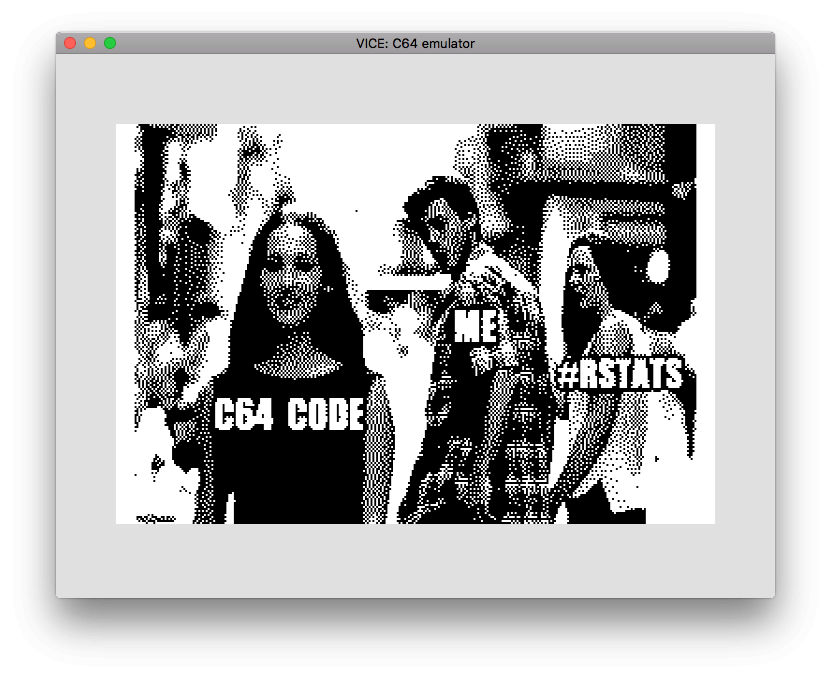
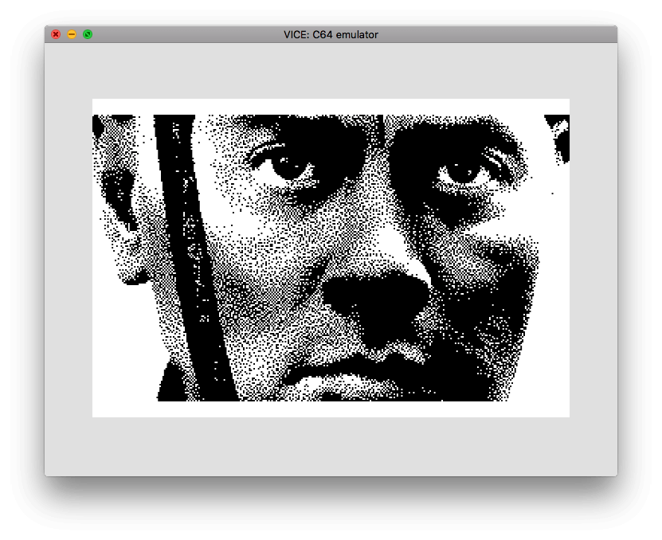

```{r setup, include = FALSE}
suppressPackageStartupMessages({
  library(dplyr)
  library(magick)
  library(glue)
  library(c64asm)
})
knitr::opts_chunk$set(
  collapse = TRUE,
  comment = "#>"
)
```

Hires bitmap
------------------------------------------------------------------------------

In this vignette, `c64asm` will be used to:

* generate a 320x200 hires R logo in bitmap form suitable for the c64.
* incorporate those bytes into an R program using the `c64asm` package and the R-specific `.rbyte` directive.
* compile the code and run it in an emulator (VICE).


Converting an image into a monochrome bitmap matix
------------------------------------------------------------------------------

* Use imagemagick to convert an image into:
    * 320x200
    * monochrome
    * dithered
    * keeping aspect ratio while padding to the correct size

```{r}

#-----------------------------------------------------------------------------
#' Create a 320x200 binary matrix out of an image file
#' 
#' @param image_filename full path to an image that can be read by imagemagick
#' @param dither boolean. floyd steinberg dithering?  default: TRUE
#' @param invert boolean. invert the image? default TRUE
#'
#' @importFrom glue glue
#' @return a 200x320 binary matrix (values of only 0 and 1) representing the 
#'         dithered black and white image
#-----------------------------------------------------------------------------
create_bw_matrix_image <- function(image_filename = system.file('img/Rlogo.jpg',package='jpeg'), dither=TRUE, invert=FALSE, padding='white') {
  
  # Temporary output file
  monochrome_filename <- tempfile(fileext=".pgm")
  
  # The size of the hires bitmap screen on a c64
  width   <- 320
  height  <- 200
  
  # I couldn't work out how to do all the manipulation 
  # just using the 'magick' package (e.g. -extent), so
  # construct a imagemagick convert command in the shell
  dither_    <- ifelse(dither, "-dither FloydSteinberg", "")
  monochrome <- "-colors 2 -colorspace gray -normalize"
  command    <- glue::glue("convert {shQuote(image_filename)} -resize {width}x{height} -background {padding} -gravity center -extent {width}x{height} {monochrome} {dither_} {monochrome_filename}")
  
  system(command)
  
  im <- magick::image_read(monochrome_filename) 
  im <- im[[1]][1,,]
  mode(im) <- 'integer'
  im[] <- as.integer(im == 255)
  
  bw_matrix <- t(im)
  
  if (invert) {
    bw_matrix <- 1L - bw_matrix
  }
  
  bw_matrix
}
```


Convert a 0/1 matrix into a bytestream ready for the c64
------------------------------------------------------------------------------

* The hires bitmap is encoded one character at a time, rather than 1 row at a time
* This means extra work needs to be done to turn a matrix of 0/1 into a bytestream 
  image for the c64


```{r comment=NA}
#-----------------------------------------------------------------------------
# Convert a sequence of eight 0/1 values into a byte
#-----------------------------------------------------------------------------
bits_to_byte <- function(eight_bits) {
  stopifnot(length(eight_bits) == 8)
  stopifnot(all(eight_bits %in% c(0, 1)))
  as.integer(sum(2^seq.int(7, 0)  * eight_bits))
}


#-----------------------------------------------------------------------------
# Convert a row of a binary matrix into a vector of bytes.
#-----------------------------------------------------------------------------
row_to_bytes <- function(row) {
  split(row, ceiling(seq_along(row)/8)) %>%
    purrr::map_int(bits_to_byte)
}


#-----------------------------------------------------------------------------
#' Turn a binary matrix into bytes for a c64 bitmap
#-----------------------------------------------------------------------------
create_c64_byte_image <- function(bw_matrix) {
  stopifnot(max(bw_matrix) == 1)
  stopifnot(identical(dim(bw_matrix), c(200L, 320L)))
  
  # Turn each row of bits into a row of bytes
  byte_image <- t(apply(bw_matrix, 1, row_to_bytes))
  
  # Reorder the bytes to use as a c64 bitmap.
  # The ordering of a c64 bitmap is unconventional by modern standards!
  c64_byte_image <- seq(1, 200-8+1, 8) %>%
    purrr::map(~as.vector(byte_image[.x:(.x+7),])) %>%
    purrr::flatten_int()
  
  c64_byte_image
}


bw_matrix <- create_bw_matrix_image(dither=FALSE, invert=FALSE)
c64_image <- create_c64_byte_image(bw_matrix)
```


Create an image of the R logo
------------------------------------------------------------------------------

```{r}
bw_matrix <- create_bw_matrix_image(image_filename = system.file('img/Rlogo.jpg',package='jpeg'), dither=TRUE)
c64_image <- create_c64_byte_image(bw_matrix)
```


```{r eval=FALSE, echo=FALSE}
# library(ggplot2)
# p <- ggplot(mtcars) + 
#   geom_point(aes(mpg, wt), size=10) + 
#   theme_bw(50) + 
#   labs(title = "geom_c64(mtcars)") +
#   theme(
#     text = element_text(face='bold'),
#     panel.grid = element_line(colour='black')
#   )
# 
# ggsave("../working/ggplot.png", plot = p, width = 320, height = 200, units = 'mm')
# 
# 
# bw_matrix <- create_bw_matrix_image(image_filename = "../working/ggplot.png", dither=FALSE, invert=FALSE)
# c64_image <- create_c64_byte_image(bw_matrix)
```


```{r eval=FALSE, echo=FALSE}
bw_matrix <- create_bw_matrix_image(image_filename = "../working/dol2.jpg", dither=FALSE, invert=FALSE)
c64_image <- create_c64_byte_image(bw_matrix)
```


```{r}

asm <- '*=$0801
.byte $0c, $08, $0a, $00, $9e, $20  ; 10 SYS 2080
.byte $32, $30, $38, $30, $00, $00
.byte $00

*=$0820

  ;===========================================================================
  ; Set VICII to Bank0
  ;
  ; $dd00
  ;   %xxxxxx11 -> bank0  ; #$03
  ;   %xxxxxx10 -> bank1
  ;   $xxxxxx01 -> bank2
  ;   $xxxxxx00 -> bank3
  ;===========================================================================
  lda $dd00
  ora #$03
  sta $dd00
  
  ;===========================================================================
  ; Reference: http://codebase64.org/doku.php?id=base:vicii_memory_organizing
  ; Screen, character memory and bitmap addresses: $d018
  ;  7654 321 0
  ;  ^    ^   ^-- Unused
  ;  |    |
  ;  |    ------- Bitmap mode and character dot data base address
  ;  |
  ;  ------------ Video matrix base address
  ;
  ;===========================================================================


  ;===========================================================================
  ;  Set bitmap to BANK0 + $2000
  ; 
  ; $d018
  ;   %xxxx0xxx -> bitmap offset $0000      #$00
  ;   %xxxx1xxx -> bitmap offset $2000      #$08
  ;
  ;   %0000xxxx -> screenmem is at $0000
  ;   %0001xxxx -> screenmem is at $0400
  ;   %0010xxxx -> screenmem is at $0800
  ;   %0011xxxx -> screenmem is at $0c00    #$30
  ;   %0100xxxx -> screenmem is at $1000
  ;   %0101xxxx -> screenmem is at $1400
  ;   %0110xxxx -> screenmem is at $1800
  ;   %0111xxxx -> screenmem is at $1c00
  ;   %1000xxxx -> screenmem is at $2000
  ;   %1001xxxx -> screenmem is at $2400
  ;   %1010xxxx -> screenmem is at $2800
  ;   %1011xxxx -> screenmem is at $2c00
  ;   %1100xxxx -> screenmem is at $3000
  ;   %1101xxxx -> screenmem is at $3400
  ;   %1110xxxx -> screenmem is at $3800
  ;   %1111xxxx -> screenmem is at $3c00
  ;===========================================================================
  lda $d018
  ora #$08   ; Set bitmap offset to $2000
  ora #$30   ; set screenmem to $0c00
  sta $d018


  ;===========================================================================
  ;  Set screen to bitmap mode
  ; 
  ; $d011 - Screen Control register 1
  ;   Bits 0-2  YSCROLL Vertical Raster Scroll
  ;   Bit  3    RSEL    Screen height  0=24, 1=25
  ;   Bit  4    DEN     0=Screen off, 1=Screen on
  ;   Bit  5    BMM     0=Text mode, 1=bitmap mode
  ;   Bit  6    ECM     1 = Extended background mode
  ;   Bit  7    RST8    When read, is the top bit of the current raster line
  ;                     When written is the top bit of the raster line at which to
  ;                     generate interupt
  ;
  ; $d016 - Screen Control register 2
  ;   Bits 0-2   XSCROLL Horizontal Raster Scroll
  ;   Bit  3     CSEL    Screen width  0 = 38, 1 = 40
  ;   Bit  4     MCM     1 = Multi-colour Character Mode on
  ;   Bit  5     RES
  ;
  ; Standard screen modes - https://www.c64-wiki.com/wiki/Standard_Bitmap_Mode
  ;   Mode   ECM BMM MCM    Result
  ;      0     0   0   0    Standard character mode
  ;      1     0   0   1    Multicolor Character Mode
  ;      2     0   1   0    Standard Bitmap Mode
  ;      3     0   1   1    Extended Background Colour mode
  ;===========================================================================
  lda $d011
  and #$BF    ; Unset bit 6 (ECM = 0) -> NOT extended background mode
  ora #$20    ; Set   bit 5 (BMM = 1) -> bitmap mode
  sta $d011  

  lda $d016
  and #$ef    ; Unset bit 4 (MCM = 0) -> NOT multicolor character mode
  sta $d016

  jsr initcolour  ; set screenmem colour

end: 
  jmp end


;--------------------------------------------------------------
; Initialise colour in each 8x8 block to black
; The screen mem colour sets the fg/bg colour at each location
; Bits 0-3   =>  colour for "0"
; Bits 4-7   =>  colour for "1"
;
; e.g.     0001 0000   = #$10
;         white black
;          fg    bg
;--------------------------------------------------------------
initcolour: 
           inc $d020
		       ldx #$00
           lda #$10   ; white fg, black background
colourloop:
           sta $0c00,x
           sta $0cfa,x
           sta $0df4,x
           sta $0eee,x
           inx
           cpx #$fa
           bne colourloop
           rts


;--------------------------------------------------------------
; Include the bitmap data where the VICII will find it.
;--------------------------------------------------------------
* = $2000
  .rbyte c64_image
'
```


Compile ASM code to PRG
------------------------------------------------------------------------------

```{r eval=FALSE}
library(c64asm)

# compile code in a single step
prg <- c64asm::compile(asm)
head(prg, 100)
```

See the `prg` directory in this package for ready-to-run PRGs of this code.


Run code in an emulator
------------------------------------------------------------------------------

```{r eval=FALSE}
library(c64vice)

# Start VICE with 'x64sc -binarymonitor'
# Then transfer bytes to VICE and run the program with the following:
c64vice::run_prg(prg)
```


```{r echo=FALSE, eval=FALSE}
c64vice::save_screenshot("vignettes/img/bitmap.png")
```


Other examples
------------------------------------------------------------------------------






