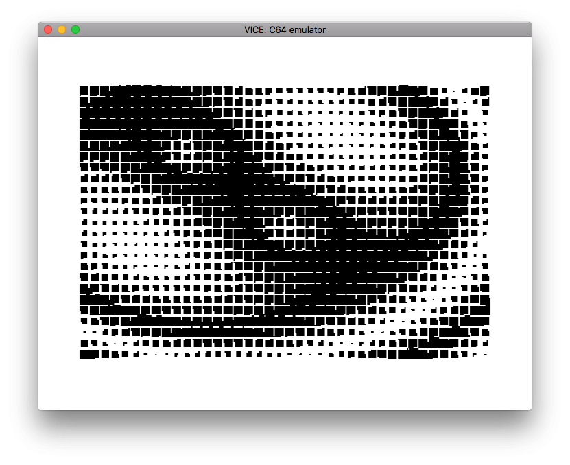
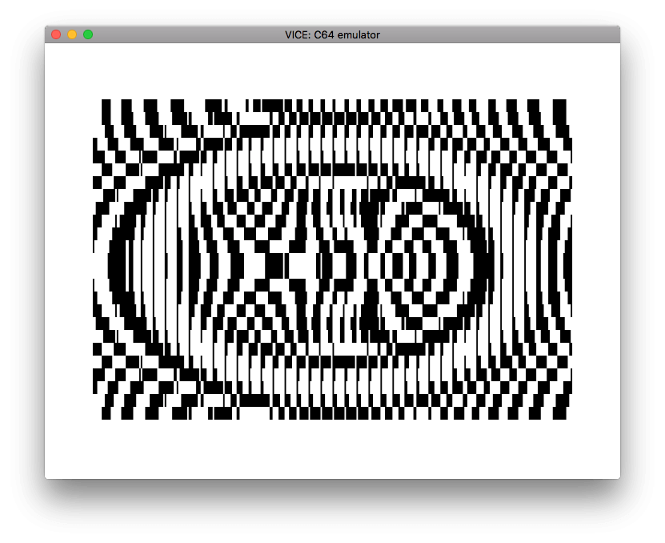

```{r setup, include = FALSE}
suppressPackageStartupMessages({
  library(dplyr)
  library(c64asm)  
})

knitr::opts_chunk$set(echo=TRUE)
```

```{r echo=FALSE}
#-----------------------------------------------------------------------------
# Create a character set that wipes from side to side
#-----------------------------------------------------------------------------
create_sideswipe_charset <- function() {
  charset <- as.integer(c(0x00, 0x01, 0x01, 0x03, 0x03, 0x07, 0x07, 0x0f,
                          0x0f, 0x1f, 0x1f, 0x3f, 0x3f, 0x7f, 0x7f, 0xff))
  
  charset <- c(charset, 255L  - (charset))
  charset <- rep(charset, each=8)
  charset <- rep(charset, times=8)
  
  # 256 characters. 8 bytes each
  stopifnot(length(charset) == 256 * 8)
  charset
}
```


```{r echo=FALSE}
#-----------------------------------------------------------------------------
# creating a spiral character set where the pixels are set from the middle first
# and spiral out to completely fill the 8x8 grid
#-----------------------------------------------------------------------------
create_spiral_charset <- function() {
  
  #---------------------------------------------------------------------------
  # Define what (r)ight, (d)own, (l)eft, (u)p convert to in terms of 
  # position deltas in the x, y directions
  #---------------------------------------------------------------------------
  vec <- tibble(
    direction = c('r', 'd', 'l', 'u'),
    x         = c( 1 ,  0 , -1 ,  0 ),
    y         = c( 0,  -1 ,  0 ,  1 )
  )
  
  #---------------------------------------------------------------------------
  # Basic spiral pattern
  #---------------------------------------------------------------------------
  spiral <- tibble(
    direction = rep(c('r', 'd', 'l', 'u'), times=4),
    length    = rep(1:8, each=2)
  ) %>% left_join(vec, by='direction')
  
  #---------------------------------------------------------------------------
  # Unroll the spiral
  #---------------------------------------------------------------------------
  spiral <- spiral %>%
    slice(rep(seq(nrow(.)), times=.$length))
  
  #---------------------------------------------------------------------------
  # Work out the x,y of each pixel
  #---------------------------------------------------------------------------
  spiral <- spiral %>%
    add_row(x=4, y=5, .before = 1) %>%
    mutate(
      x = cumsum(x), 
      y = cumsum(y)
    )
  
  #---------------------------------------------------------------------------
  # Trim to just 64 pixels (8x8 charset)
  #---------------------------------------------------------------------------
  spiral <- spiral %>%
    select(x, y) %>%
    head(64)
  
  
  #---------------------------------------------------------------------------
  # Helper to conver:  c(0, 0, 0, 1, 1, 0, 0, 0) -> 24
  #---------------------------------------------------------------------------
  row_to_byte <- function(row) {
    as.integer(sum(2^(7:0) * (row > 0)))
  }
  
  
  #---------------------------------------------------------------------------
  # Create character 'n' in the spiral sequence
  #---------------------------------------------------------------------------
  create_char <- function(n) {
    char <- matrix(0L, nrow = 8, ncol=8)
    for (i in seq_len(n)) {
      char[spiral$y[i], spiral$x[i]] <- 1
    }
    # char
    apply(char, 1, row_to_byte)
  }
  
  
  #---------------------------------------------------------------------------
  # Create the character set
  #---------------------------------------------------------------------------
  charset <- seq(0, 64) %>% purrr::map(create_char) 
  
  #---------------------------------------------------------------------------
  # Create the reverse sequence
  #---------------------------------------------------------------------------
  charset_rev <- rev(charset) %>% head(-1) %>% tail(-1)
  
  #---------------------------------------------------------------------------
  # Combine forwards and reverse spirals, repeat chars as necessary
  #---------------------------------------------------------------------------
  charset <- rep(c(charset, charset_rev), times=2)
  charset <- purrr::flatten_int(charset)
  
  # 256 characters. 8 bytes each
  stopifnot(length(charset) == 256 * 8)
  charset
}
```


```{r echo=FALSE}
create_two_sine_screen <- function() {
  screen_state  <- expand.grid(x=1:40, y=1:25) %>%
    as.tbl() %>%
    mutate(
      x2  = (x - 21  ) / (40-1),
      y2  = (y - 13.5) / (25-1),
      x  = (x - 11  ) / (40-1),
      y  = (y - 6.5 ) / (25-1),
      # z  = sin(1.3 * sqrt(x^2 + y^2))  + cos(sqrt(x2^2 + y2^2)),
      z  = sin(4 * sqrt(x^2 + y^2)) + sin(4 * sqrt(x2^2 + y2^2)),
      z  = (z - min(z)) / (max(z) - min(z)),
      z  = as.integer(z * 255)
    )
  screen_state$z
}

create_sine_screen <- function() {
  screen_state  <- expand.grid(x=1:40, y=1:25) %>%
    as.tbl() %>%
    mutate(
      x = (x - 21  ) / (40-1),
      y = (y - 13.5) / (25-1),
      z = sin(4 * sqrt(x^2 + y^2)),
      z = (z - min(z)) / (max(z) - min(z)),
      z = as.integer(z * 255)
    )
  screen_state$z
}

create_scroll_screen <- function() {
  as.integer(1:1000 %% 256)
}

create_diag_sine_screen <- function() {
  screen_state  <- expand.grid(x1=1:40, y1=1:25) %>%
    as.tbl() %>%
    mutate(
      x = (x1 - 20  ) / (40),
      y = (y1 - 13.5) / (25),
      z = sin(x/2 + y),
      z = (z - min(z)) / (max(z) - min(z)),
      z = as.integer(z * 255)
    )
  screen_state$z
}
```


Use R to create character data and initial screen layout 
------------------------------------------------------------------------------

The functions for creating charsets and initial screen states are included
at the bottom of this vignette

* Charsets    
    * 255 characters in a character set
    * each character made up of 8 bytes
    * `create_spiral_charset()` creates a character set with a single dot in the 
      middle of the 8x8 bits for a character. Each subsequent character has a pixel
      added in a spiral pattern.
    * `create_sideswipe_charset()` creates a a full 8x8 block swiping through the 
      character. 
* Screen state
    * 40x25 bytes to define the initial character at each screen location
    * `create_two_sine_screen()` uses some trig functions for an interesting start
    
```{r}
charset_name <- 'sideswipe'
screen_name  <- 'diag_sine'

charset <- switch(charset_name, 
                  sideswipe     = create_sideswipe_charset(),
                  spiral        = create_spiral_charset())

screen_state <- switch(screen_name,
                       two_sine   = create_two_sine_screen(),
                       sine       = create_sine_screen(),
                       scroll     = create_scroll_screen(),
                       diag_sine  = create_diag_sine_screen())


# To keep things simple for 8-bit offsets, 
# split the full screen state into 250 byte chunks
screen_state1 <- screen_state[  1: 250]
screen_state2 <- screen_state[251: 500]
screen_state3 <- screen_state[501: 750]
screen_state4 <- screen_state[751:1000]
```


Write c64 6502 ASM.
------------------------------------------------------------------------------

* Use the `.rbyte` directive to include the bytes for the screen state directly.
* Place the character set at a known character set location (using `*=$2000`) and 
  `.rbyte`, and then let the c64 know where it is using location `$d018`

```{r}
asm <- '*=$0801
.byte $0c, $08, $0a, $00, $9e, $20  ; 10 SYS 2080
.byte $32, $30, $38, $30, $00, $00
.byte $00
*=$0820
           sei          ; turn off interrupts
           lda #$7f
           ldx #$01
           sta $dc0d    ; Turn off CIA 1 interrupts
           sta $dd0d    ; Turn off CIA 2 interrupts
           stx $d01a    ; Turn on raster interrupts

           lda #$1b
           ldx #$08
           ldy #$14
           sta $d011    ; Clear high bit of $d012, set text mode
           stx $d016    ; single-colour
           sty $d018    ; screen at $0400, charset at $2000

           lda $d018    ; Changing character set to $3800 - $3800 + $800 (2048 bytes)
           and #$f0
           ora #$08
           sta $d018

           lda #$01     ; set background screen colours to white
           sta $d020
           sta $d021

           jsr initscr
           jsr initcolour


           lda #<int    ; low part of address of interrupt handler code
           ldx #>int    ; high part of address of interrupt handler code
           ldy #$80     ; line to trigger interrupt
           sta $0314    ; store in interrupt vector
           stx $0315
           sty $d012

           lda $dc0d    ; ACK CIA 1 interrupts
           lda $dd0d    ; ACK CIA 2 interrupts
           asl $d019    ; ACK VIC interrupts
           cli

loop:
           jmp loop     ; infinite loop


;--------------------------------------------------------------
; Initialise screen characters
;--------------------------------------------------------------
initscr:
		       ldx #$00
scrloop:
           lda screen1, x
           sta $0400,x
           lda screen2, x
           sta $04fa,x
           lda screen3, x
           sta $05f4,x
           lda screen4, x
           sta $06ee,x
           inx
           cpx $fa
           bne scrloop

           rts


;--------------------------------------------------------------
; Initialise character colours to black
;--------------------------------------------------------------
initcolour: 
		       ldx #$00
           lda #$00    ; black
colourloop:
           sta $d800,x
           sta $d8fa,x
           sta $d9f4,x
           sta $daee,x
           inx
           cpx #$fa
           bne colourloop
           rts


;--------------------------------------------------------------
; Inrement every character on the screen. 
; Race behind the raster so we dont get any screen tearing
;--------------------------------------------------------------
incscreen:
		       ldx #$00
incscr1:
           inc $0400,x
           inx
           cpx #$fa
           bne incscr1

		       ldx #$00
incscr2:
           inc $04fa,x
           inx
           cpx #$fa
           bne incscr2

		       ldx #$00
incscr3:
           inc $05f4,x
           inx
           cpx #$fa
           bne incscr3

		       ldx #$00
incscr4:
           inc $06ee,x
           inx
           cpx #$fa
           bne incscr4

           rts


;--------------------------------------------------------------
; Interupt routine that is called once per frame
;--------------------------------------------------------------
int:
           ;inc $d020    ; increment border colour

           jsr incscreen

           ;dec $d020    ; decrement border colour

           asl $d019    ; ACK interrupt (to re-enable it)

           pla          ; prepare to return from interupt
           tay
           pla
           tax
           pla
           rti          ; return from interrupt

;--------------------------------------------------------------
; Data storage of the initial screen state
;--------------------------------------------------------------
screen1   .rbyte screen_state1
screen2   .rbyte screen_state2
screen3   .rbyte screen_state3
screen4   .rbyte screen_state4

;--------------------------------------------------------------
; Charset from R at a known charset location
;--------------------------------------------------------------
* = $2000
          .rbyte charset

'


```


Compile ASM code to PRG
------------------------------------------------------------------------------

```{r eval=FALSE}
library(c64asm)

# compile
prg <- c64asm::compile(asm)
head(prg, 100)
```


Run code in an emulator
------------------------------------------------------------------------------

```{r eval=FALSE}
library(c64vice)

# Start VICE with 'x64sc -binarymonitor'
# Then transfer bytes to VICE and run the program with the following:
c64vice::run_prg(prg)
```


```{r echo=FALSE, eval=FALSE}
c64vice::save_screenshot("vignettes/img/bitmap.png")
```






Appendix: Create custom character sets
------------------------------------------------------------------------------

```{r eval=FALSE}
#-----------------------------------------------------------------------------
# Create a character set that wipes from side to side
#-----------------------------------------------------------------------------
create_sideswipe_charset <- function() {
  charset <- as.integer(c(0x00, 0x01, 0x01, 0x03, 0x03, 0x07, 0x07, 0x0f,
                          0x0f, 0x1f, 0x1f, 0x3f, 0x3f, 0x7f, 0x7f, 0xff))
  
  charset <- c(charset, 255  - (charset))
  charset <- rep(charset, each=8)
  charset <- rep(charset, times=8)
  
  # 256 characters. 8 bytes each
  stopifnot(length(charset) == 256 * 8)
  charset
}
```


```{r eval=FALSE}
#-----------------------------------------------------------------------------
# creating a spiral character set where the pixels are set from the middle first
# and spiral out to completely fill the 8x8 grid
#-----------------------------------------------------------------------------
create_spiral_charset <- function() {
  
  #---------------------------------------------------------------------------
  # Define what (r)ight, (d)own, (l)eft, (u)p convert to in terms of 
  # position deltas in the x, y directions
  #---------------------------------------------------------------------------
  vec <- tibble(
    direction = c('r', 'd', 'l', 'u'),
    x         = c( 1 ,  0 , -1 ,  0 ),
    y         = c( 0,  -1 ,  0 ,  1 )
  )
  
  #---------------------------------------------------------------------------
  # Basic spiral pattern
  #---------------------------------------------------------------------------
  spiral <- tibble(
    direction = rep(c('r', 'd', 'l', 'u'), times=4),
    length    = rep(1:8, each=2)
  ) %>% left_join(vec, by='direction')
  
  #---------------------------------------------------------------------------
  # Unroll the spiral
  #---------------------------------------------------------------------------
  spiral <- spiral %>%
    slice(rep(seq(nrow(.)), times=.$length))
  
  #---------------------------------------------------------------------------
  # Work out the x,y of each pixel
  #---------------------------------------------------------------------------
  spiral <- spiral %>%
    add_row(x=4, y=5, .before = 1) %>%
    mutate(
      x = cumsum(x), 
      y = cumsum(y)
    )
  
  #---------------------------------------------------------------------------
  # Trim to just 64 pixels (8x8 charset)
  #---------------------------------------------------------------------------
  spiral <- spiral %>%
    select(x, y) %>%
    head(64)
  
  
  #---------------------------------------------------------------------------
  # Helper to conver:  c(0, 0, 0, 1, 1, 0, 0, 0) -> 24
  #---------------------------------------------------------------------------
  row_to_byte <- function(row) {
    as.integer(sum(2^(7:0) * (row > 0)))
  }
  
  
  #---------------------------------------------------------------------------
  # Create character 'n' in the spiral sequence
  #---------------------------------------------------------------------------
  create_char <- function(n) {
    char <- matrix(0L, nrow = 8, ncol=8)
    for (i in seq_len(n)) {
      char[spiral$y[i], spiral$x[i]] <- 1
    }
    # char
    apply(char, 1, row_to_byte)
  }
  
  
  #---------------------------------------------------------------------------
  # Create the character set
  #---------------------------------------------------------------------------
  charset <- seq(0, 64) %>% purrr::map(create_char) 
  
  #---------------------------------------------------------------------------
  # Create the reverse sequence
  #---------------------------------------------------------------------------
  charset_rev <- rev(charset) %>% head(-1) %>% tail(-1)
  
  #---------------------------------------------------------------------------
  # Combine forwards and reverse spirals, repeat chars as necessary
  #---------------------------------------------------------------------------
  charset <- rep(c(charset, charset_rev), times=2)
  charset <- purrr::flatten_int(charset)
  
  # 256 characters. 8 bytes each
  stopifnot(length(charset) == 256 * 8)
  charset
}
```


Appendix: Initial screen state.
------------------------------------------------------------------------------

* Functions should return 1000 integers, representing the 40x25 characters
  for the screen

```{r eval=FALSE}
create_sine_screen <- function() {
  screen_state  <- expand.grid(x=1:40, y=1:25) %>%
    as.tbl() %>%
    mutate(
      x = (x - 21  ) / (40-1),
      y = (y - 13.5) / (25-1),
      z = sin(4 * sqrt(x^2 + y^2)),
      z = (z - min(z)) / (max(z) - min(z)),
      z = as.integer(z * 255)
    )
  screen_state$z
}


create_scroll_screen <- function() {
  as.integer(1:1000 %% 256)
}


create_diag_sine_screen <- function() {
  screen_state  <- expand.grid(x1=1:40, y1=1:25) %>%
    as.tbl() %>%
    mutate(
      x = (x1 - 20  ) / (40),
      y = (y1 - 13.5) / (25),
      z = sin(x/2 + y),
      z = (z - min(z)) / (max(z) - min(z)),
      z = as.integer(z * 255)
    )
  screen_state$z
}


create_two_sine_screen <- function() {
  screen_state  <- expand.grid(x=1:40, y=1:25) %>%
    as.tbl() %>%
    mutate(
      x2  = (x - 21  ) / (40-1),
      y2  = (y - 13.5) / (25-1),
      x  = (x - 11  ) / (40-1),
      y  = (y - 6.5 ) / (25-1),
      # z  = sin(1.3 * sqrt(x^2 + y^2))  + cos(sqrt(x2^2 + y2^2)),
      z  = sin(4 * sqrt(x^2 + y^2)) + sin(4 * sqrt(x2^2 + y2^2)),
      z  = (z - min(z)) / (max(z) - min(z)),
      z  = as.integer(z * 255)
    )
  screen_state$z
}


```
