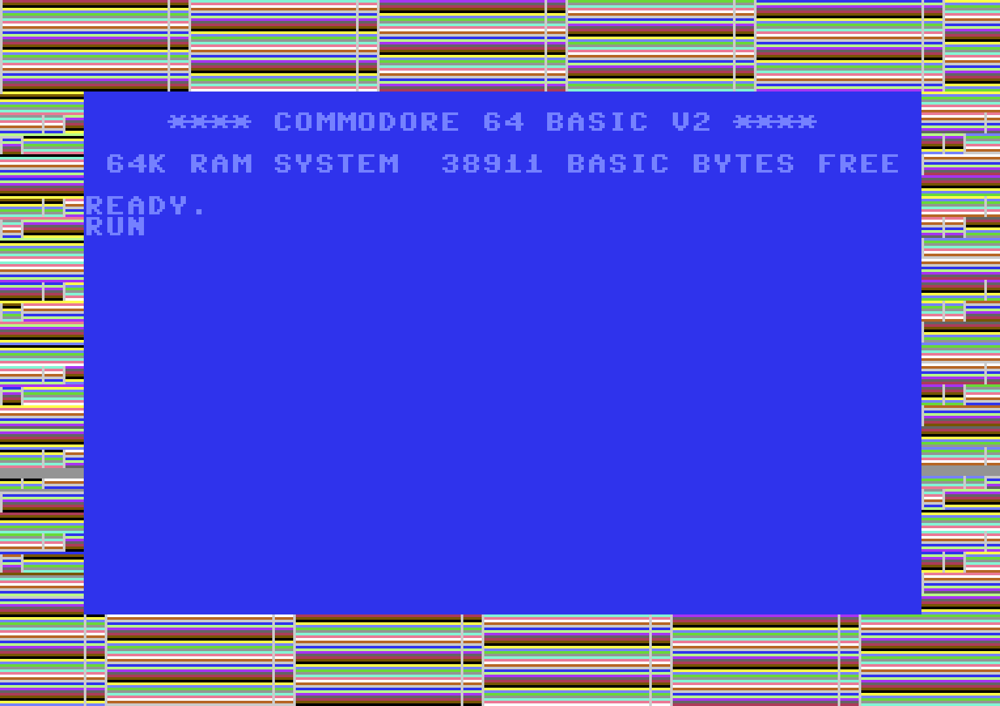

```{r setup, include = FALSE}
suppressPackageStartupMessages({
  library(c64asm)  
})

knitr::opts_chunk$set(
  collapse = TRUE,
  comment = "#>"
)
```


Write your c64 ASM code to flash the screen border
------------------------------------------------------------------------------

```{r}
asm <- '
*=$0801                               ; This is the BASIC stub which will run the code
  .byte $0c, $08, $0a, $00, $9e, $20  ; 10 SYS 2080
  .byte $32, $30, $38, $30, $00, $00
  .byte $00

*=$0820             ; Set address for this code. $0820 = 2080
loop
      inc $d020     ; increase the border colour memory location
      jmp loop      ; repeat forever
'
```


Compile ASM code to PRG
------------------------------------------------------------------------------

```{r eval=FALSE}
library(c64asm)

# compile
prg <- c64asm::compile(asm)
head(prg, 100)
```

See the `prg` directory in this package for ready-to-run PRGs of this code.


Run code in an emulator
------------------------------------------------------------------------------

```{r eval=FALSE}
library(c64vice)

# Start VICE with 'x64sc -binarymonitor'
# Then transfer bytes to VICE and run the program with the following:
c64vice::run_prg(prg)
```


```{r echo=FALSE, eval=FALSE}
c64vice::save_screenshot("vignettes/img/helloborder.png")
```





