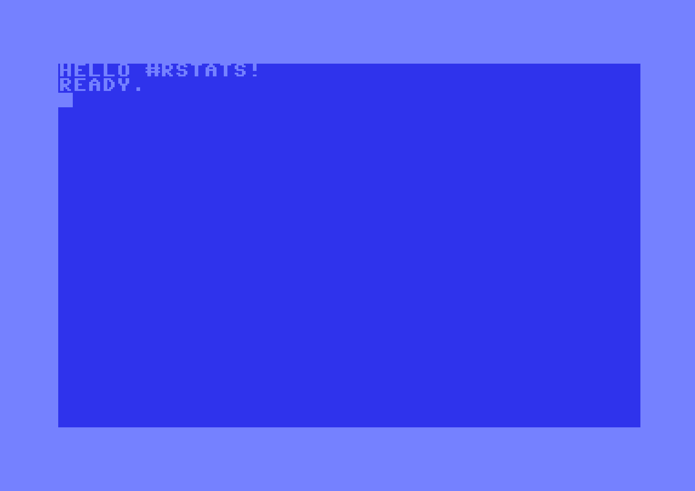

```{r setup, include = FALSE}
suppressPackageStartupMessages({
  library(c64asm)  
})

knitr::opts_chunk$set(
  collapse = TRUE,
  comment = "#>"
)
```

Write your c64 ASM code
------------------------------------------------------------------------------

* The syntax is roughly modelled on that of TASS64, but only for the fundamentals i.e.
    * `*` refers to current address location, and can be read from or written to
    * All programs should start with a `*=....` line to set the starting address
    * `.byte` values must be hexadecimal only, and single byte hexadecimal must **always**
      include 2 characters.  i.e. `$0e` will work, but `$e` won't work.
    * Similarly, for immediate values. i.e. `#$01` will work. `#$1` won't work.

```{r}
library(c64asm)

asm <- '
*=$0801
  .byte $0c, $08, $0a, $00, $9e, $20
  .byte $32, $30, $38, $30, $00, $00
  .byte $00

*=$0820
      lda #$93        ; Clear the screen
      jsr $ffd2

      ldx #$00        ; initialise the offset pointer into our message
loop  lda message,x   ; load a character and write it to screen 
      and #$3f        ; Manually place chars on screen
      sta $0400,x
      inx
      cpx #$0e
      bne loop

      rts

message
    .text "Hello #rstats!"
'
```


Compile in one step
------------------------------------------------------------------------------

* If you're willing to trust the compiler, then use `c64asm::compile()` to convert
  ASM into bytes.
* Still have to extract the bytes from the `prg_df` data.frame to view and save.

```{r}
prg <- c64asm::compile(asm)

prg
```


Compile in multiple steps (for debugging purposes)
------------------------------------------------------------------------------

* When debugging the output, you can manually run the compilation steps and
  view the output at each stage.
* `c64asm` isn't a complete or bug-free assembler by any means!

```{r}
line_tokens <- c64asm::create_line_tokens(asm)

prg_df      <- c64asm::create_prg_df(line_tokens)
prg_df      <- c64asm::process_symbols(prg_df)
prg_df      <- c64asm::process_zero_padding(prg_df)

c64asm::extract_prg_bytes(prg_df)
```


Run code in an emulator
------------------------------------------------------------------------------

```{r eval=FALSE}
library(c64vice)

# Start VICE with 'x64sc -binarymonitor'
# Then transfer bytes to VICE and run the program with the following:
c64vice::run_prg(prg)
```


```{r echo=FALSE, eval=FALSE}
c64vice::save_screenshot("vignettes/img/helloworld.png")
```



