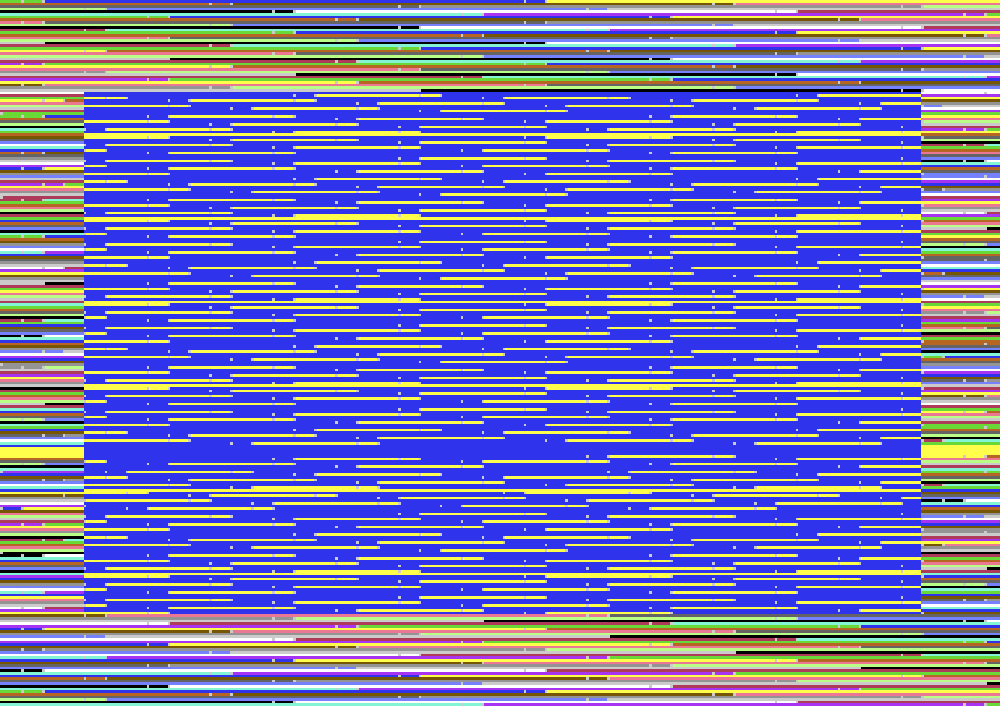

```{r setup, include = FALSE}
suppressPackageStartupMessages({
  library(c64asm)  
})

knitr::opts_chunk$set(
  collapse = TRUE,
  comment = "#>"
)
```

Symbol and PC arithmetic
------------------------------------------------------------------------------

* To make writing code easier, most 6502 assemblers support arithmetic on symbols and the program counter.
* These calculations are resolved at compile time
* This is useful for: 
    * jumping to a location 10 bytes ahead: `jmp {.* + 10}`
    * indexing byte offset from a known location:  `lda {message + 20}`
* `c64asm` allows
    * bare symbols to refer to values e.g. `border` 
    * use of `.*` to refer to the current address at the start of this instruction
    * arithmetic on the symbols must be wrapped in `{}`
* Internally, the contents of `{}` are evaluated with `eval(parse(text=...))` with an environment consisting
  of all known variables and the current address


```{r}
library(c64asm)

asm <- '
*=$0801
  .byte $0c, $08, $0a, $00, $9e, $20
  .byte $32, $30, $38, $30, $00, $00
  .byte $00

border = $d020         ; use a variable/symbol for the border colour memory loation

*=$0820
      lda #$93         ; Clear the screen
      jsr $ffd2

loop  
      inc border       ; increment the memory location responsible for border colour
crap
      inc {border + 1} ; increase the memory location at `border+1` i.e. $d021 (screen colour)
      dec {border + 1} ; decrease it
      jmp {.* + 6}     ; skip 6 bytes ahead from the start of this line
      nop
      nop
      nop
      jmp {crap - 3}   ; jmp to the location 3 bytes before `crap` i.e. `loop`
'
```


Compile ASM code to PRG
------------------------------------------------------------------------------

```{r eval=FALSE}
library(c64asm)

# compile
prg <- c64asm::compile(asm)
head(prg, 100)
```


Run code in an emulator
------------------------------------------------------------------------------

```{r eval=FALSE}
library(c64vice)

# Start VICE with 'x64sc -binarymonitor'
# Then transfer bytes to VICE and run the program with the following:
c64vice::run_prg(prg)
```


```{r echo=FALSE, eval=FALSE}
c64vice::save_screenshot("vignettes/img/symbol-arithmetic.png")
```




